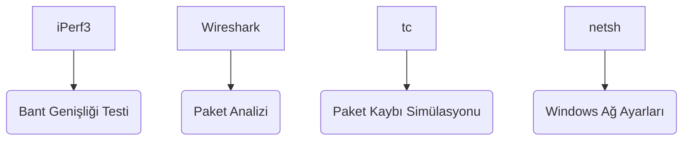
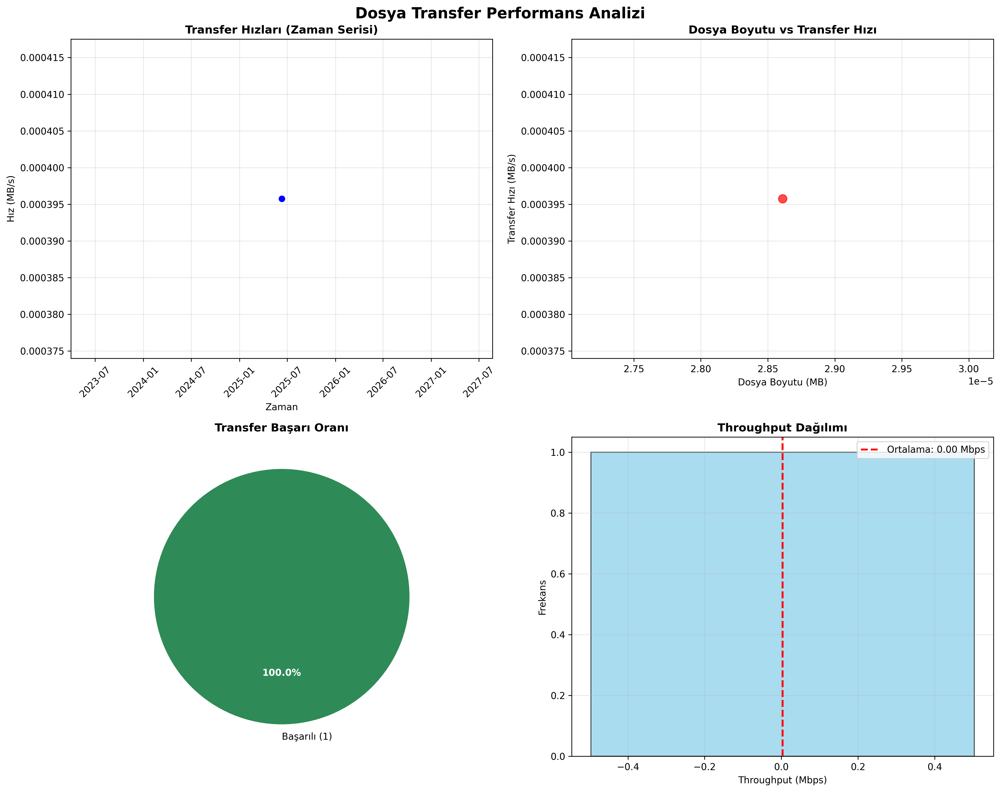
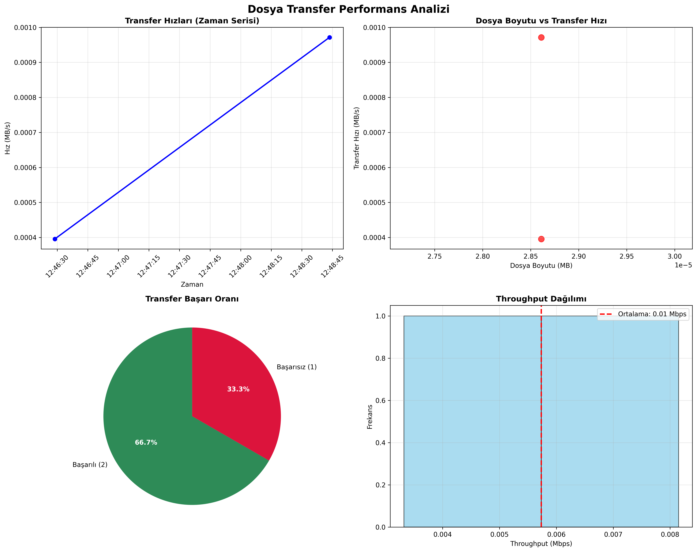
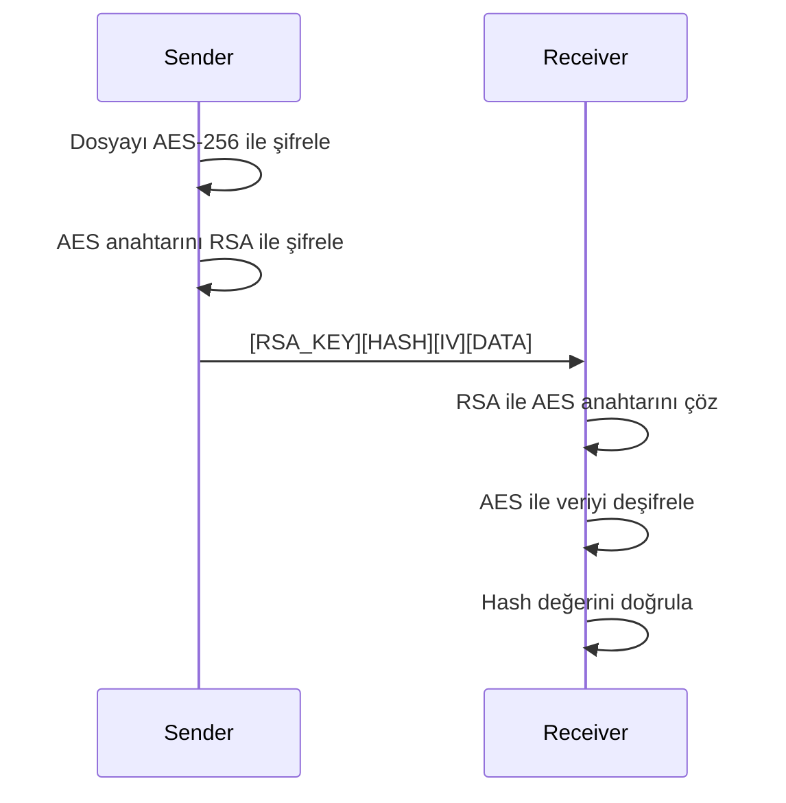

# 🔐 Gelişmiş Güvenli Dosya Transfer Sistemi  
### 💡 Düşük Seviyeli IP İşleme ve Ağ Performansı Analizi


## 📁 Proje Hakkında

Bu proje, **AES-256 ve RSA-2048** şifreleme algoritmalarını kullanan, Python dili ile geliştirilmiş **hibrit şifreleme tabanlı bir dosya transfer sistemidir**. Proje aynı zamanda **manuel IP başlık oluşturma**, **gerçek IP parçalanması (fragmentation) simülasyonu**, **RTT/bant genişliği/jitter ölçümü**, **Wireshark ile entegrasyon**, **MITM ve sahte paket saldırıları** gibi ileri düzey ağ analizlerini de içermektedir.
Sistem şu avantajları sunar:

- ✅ **Askeri seviyede şifreleme** (AES-256 + RSA-2048 hibrit model)  
- ✅ **Gerçek ağ koşullarında test edilmiş** performans ölçümleri  
- ✅ **Packet-level manipülasyon** ile ağ protokollerinin derinlemesine anlaşılması  
- ✅ **Wireshark uyumlu** detaylı analiz paketleri  
- ✅ **Çapraz platform** desteği (Linux/Windows)


---


## 🚀 Temel Özellikler

### 🔒 Hibrit Şifreleme Sistemi
- Dosya içeriği → AES-256 (CBC modu)
- AES anahtarı → RSA-2048 ile şifrelenir
- SHA-256 hash ile bütünlük kontrolü
### 📦 IP Fragmentasyonu Simülasyonu (Manuel başlıklarla)
### 📊 Performans Analiz Araçları
- Gerçek zamanlı RTT/jitter ölçümü
- iPerf3 entegrasyonu ile bant genişliği testi
- Paket kaybı simülasyonu (Linux tc)
- Transfer istatistikleri ve grafik üretimi
### 🕵️ Güvenlik Test Ortamı
- MITM saldırı simülasyonu
- Sahte UDP paket enjeksiyonu
- Aktif heartbeat izleme sistemi
- Kapsamlı hata yönetimi mekanizmaları
### 📊 Transfer Performans Verileri ve Grafiksel Görselleştirme
### 🧬 Wireshark için Marker ve Heartbeat Paketleri

---

## 🛠️ Kullanılan Teknolojiler

| Kategori        | Açıklama                                       |
|-----------------|------------------------------------------------|
| Programlama     | Python 3.11                                    |
| Kütüphaneler    | Scapy, PyCryptodome, socket, struct, hashlib   |
| Ağ Araçları     | iPerf3, Wireshark, tc (Linux), netsh (Windows) |
| Şifreleme       | AES-256 (CBC), RSA-2048                        |
| Platform Uyumu  | Linux & Windows                                |

### Çekirdek Kütüphaneler
| Kütüphane       | Versiyon | Kullanım Amacı                     |
|-----------------|----------|------------------------------------|
| PyCryptodome    | 3.18.0   | AES/RSA şifreleme işlemleri        |
| Scapy           | 2.4.5    | Paket manipülasyonu ve analiz      |
| Matplotlib      | 3.7.1    | Performans grafikleri              |
| Pandas          | 1.5.3    | Metriklerin CSV'ye aktarılması     |

### Sistem Araçları

---

## 🧱 Sistem Mimarisi

### Gönderici Modülü (`sender.py`)
```python
1. Dosya Şifreleme:
   - AES-256 ile dosya içeriğini şifrele
   - RSA-2048 ile AES anahtarını şifrele
   - SHA-256 hash hesapla

2. Paketleme:
   - Dosyayı 1024 byte'lık parçalara böl
   - Özel IP başlıkları oluştur
   - Her parçaya checksum ekle

3. Transfer:
   - TCP/UDP üzerinden gönderim
   - Wireshark marker paketleri gönder
   - Heartbeat sinyalleri yayınla
```

### Alıcı Modülü (`receiver.py`)
```python
1. Alma:
   - Parçaları sırayla birleştir
   - Checksum doğrulaması yap
   - Paket kaybını tespit et

2. Deşifreleme:
   - RSA ile AES anahtarını çöz
   - AES ile dosya içeriğini aç
   - Hash değerini doğrula

3. Raporlama:
   - Transfer istatistiklerini kaydet
   - Performans grafikleri oluştur
```


---

## 📈 Performans ve Ağ Analizi

- `performance.py`: RTT, jitter, bant genişliği ölçer
- `metrics_manager.py`: Transfer metriklerini kaydeder ve grafik üretir
- **iPerf3 Desteği**: Mbps cinsinden hız ve retransmit sayısı
- **Wireshark Entegrasyonu**: Marker, heartbeat, TTL ve fragment paketleri

---

## 🔐 Güvenlik Özellikleri

- RSA destekli hibrit şifreleme
- SHA-256 ile bütünlük kontrolü
- MITM saldırı simülasyonu
- Sahte UDP paket enjeksiyonu (Scapy ile)
- Gelişmiş hata yönetimi (timeout, bağlantı reseti vb.)

---

## 📊 Performans Metrikleri ve Grafikler

- Transfer hızı zaman çizelgesi
- Başarı oranı/başarısızlık oranı grafiği
- Paket boyutu dağılım grafiği

```bash
# 1. Alıcıyı çalıştır
python receiver.py

# 2. Göndericiyi çalıştır
python sender.py

# 3. Performans grafikleri için
python metrics_manager.py
````

---

## 🔎 Wireshark Filtreleri

| Amaç                    | Filtre İfadesi                           |
| ----------------------- | ---------------------------------------- |
| Ana TCP Trafiği         | `tcp.port == 5001`                       |
| Marker UDP Paketleri    | `udp.port == 5002`                       |
| Heartbeat Paketleri     | `udp contains "HEARTBEAT"`               |
| Fragment Test Paketleri | `udp contains "FRAG"`                    |
| Tüm İlgili Trafik       | `host 127.0.0.1 and (port 5001 or 5002)` |

---

## 📥 Kurulum Adımları

### Ön Koşullar
- Python 3.11+
- iPerf3 (performans testleri için)
- Wireshark (paket analizi için)

### Adım Adım Kurulum
```bash
# 1. Repoyu klonla
git clone https://github.com/kullanici/guvenli-transfer.git
cd guvenli-transfer

# 2. Sanal ortam oluştur (Opsiyonel)
python -m venv venv
source venv/bin/activate  # Linux/Mac
venv\Scripts\activate    # Windows

# 3. Gerekli kütüphaneleri yükle
pip install -r requirements.txt

# 4. RSA anahtar çifti oluştur
python -c "from encrypt import generate_rsa_keys; generate_rsa_keys()"

# 5. Test dosyası hazırla
mkdir test_files
echo "Bu bir test dosyasıdır." > test_files/ornek.txt
```

---

## 🖥️ Kullanım Kılavuzu

### Temel Transfer Senaryosu
```bash
# Terminal 1: UDP Listener (Wireshark verileri için)
python udp_listener.py

# Terminal 2: Alıcıyı başlat
python receiver.py

# Terminal 3: Göndericiyi çalıştır
python sender.py
```

### Gelişmiş Seçenekler
```bash
# Özel dosya transferi
python sender.py --file gizli_belge.pdf --mode udp --chunk 2048

# Ağ teşhis testleri
python receiver.py --diagnostics

# Performans grafikleri oluştur
python metrics_manager.py --graph all
```

### Parametre Listesi
| Parametre       | Açıklama                      | Varsayılan Değer |
|-----------------|-------------------------------|------------------|
| `--file`        | Transfer edilecek dosya yolu   | `ornek.txt`      |
| `--mode`        | Transfer modu (tcp/udp)       | `tcp`            |
| `--chunk`       | Parça boyutu (byte)           | `1024`           |
| `--encryption`  | Şifreleme tipi (aes/hybrid)   | `hybrid`         |

---

## 📊 Performans Analizi

### Metrik Toplama Sistemi
```python
class MetricsManager:
    def save_metrics(self, filename, file_size, duration, packet_count):
        # Transfer hızını hesapla (MB/s)
        speed = (file_size / duration) / (1024*1024)
        
        # JSON dosyasına kaydet
        metric = {
            'timestamp': datetime.now().isoformat(),
            'speed': speed,
            'success': True,
            'throughput': (file_size*8)/(duration*1_000_000)  # Mbps
        }
```

### Örnek Çıktılar

---


---

## 🔒 Güvenlik Mimarisi

### Hibrit Şifreleme Akışı


### Güvenlik Test Senaryoları
1. **MITM Saldırısı Simülasyonu**
   ```bash
   python fake_udp.py --count 100 --spoof
   ```
2. **Paket Enjeksiyonu Testi**
   ```bash
   python sender.py --inject --payload "ZARARLI_DATA"
   ```
3. **Bütünlük Kontrol Testi**
   ```bash
   python receiver.py --integrity-test
   ```

---

## 🕵️ Wireshark Entegrasyonu

### Özel Paket Yapıları
| Paket Tipi      | Formatı                          | Amaç                     |
|-----------------|----------------------------------|--------------------------|
| Marker          | `MARKER_[TYPE]_[TIMESTAMP]_[DATA]` | Önemli olayları işaretle |
| Heartbeat       | `HEARTBEAT_[COUNT]_[TIME]`       | Bağlantı sürekliliği     |
| Fragment Test   | `FRAG_[NUM]_[TOTAL]_[DATA]`      | Parçalama simülasyonu    |

### Analiz İpuçları
```wireshark
# Sadece marker paketlerini göster
udp.port == 5002 && udp contains "MARKER"

# Transfer hızını analiz et
tcp.port == 5001 && tcp.analysis.ack_rtt

# Paket kaybını tespit et
tcp.analysis.lost_segment
```

---


### Performans Testleri
| Test Adı              | Komut                     | Beklenen Sonuç           |
|-----------------------|---------------------------|--------------------------|
| Küçük Dosya Transferi | `python sender.py --file 1kb.txt` | <100ms gecikme          |
| Büyük Dosya Transferi | `python sender.py --file 1gb.iso` | >500Mbps throughput      |
| Paket Kaybı Sim.      | `python sender.py --loss 5%`      | %95 başarı oranı        |

---

## 🤝 Katkıda Bulunma

1. Repoyu fork'layın
2. Yeni branch oluşturun:
   ```bash
   git checkout -b yeni-ozellik
   ```
3. Değişikliklerinizi commit edin:
   ```bash
   git commit -m "Yeni özellik: UDP optimizasyonu"
   ```
4. Push işlemi yapın:
   ```bash
   git push origin yeni-ozellik
   ```
5. Pull request açın

---

## 📜 Lisans

Bu proje MIT lisansı altında dağıtılmaktadır. Detaylar için [LICENSE](LICENSE) dosyasına bakınız.

```text
Copyright (c) 2025 Sıdıka Fırat

İzin verilen haklar kapsamında ücretsiz kullanım, değiştirme ve dağıtım hakkı tanınır.
```


---

## 📌 Durum ve Kapsam

- ✅ AES-256 + RSA şifreleme
- ✅ IP başlığı ve parçalanma simülasyonu
- ✅ Çapraz platform destekli ağ testleri
- ✅ Performans metrikleri ve grafik üretimi
- ✅ Wireshark ile özel analiz destekleri
- ✅ Güvenlik saldırısı simülasyonları

---

## ✉️ İletişim

**Sıdıka Firat**  
🔗 [LinkedIn Profili](www.linkedin.com/in/sıdıka-firat-05ba42254)

Proje Linki: [GitHub Repo](https://github.com/sidikafirat/Dusuk-Seviyeli-IP-Isleme-ve-Ag-Performans-Analizi-ile-Gelismis-Guvenli-Dosya-Transfer-Sistemi)


